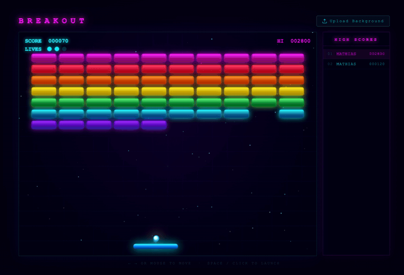

# BREAKOUT

A premium arcade Breakout game built with HTML5 Canvas and Node.js. Neon visuals, glow effects, particle explosions, persistent high scores, and infinite levels.

**Vibe coded with [Claude Code](https://claude.ai/code) using claude-sonnet-4-6.**



---

## Features

- Deep space background with neon grid overlay and star field
- Neon gradient bricks (7 rows × unique colour theme), paddle, and ball — no flat colours
- Glowing bloom effect on ball, paddle, and every brick via Canvas `shadowBlur`
- Particle burst (8–12 pieces) on every brick break, with gravity and fade
- Ball motion trail
- Infinite level progression — clearing all bricks advances to the next level at higher speed
- Persistent high score leaderboard (top 10, stored server-side in `scores.json`)
- Optional custom background image upload
- Pause / resume mid-game
- Lives system — game ends only when all lives are lost

---

## Requirements

- Node.js 18+

---

## Install & Run

```bash
npm install
npm start
```

Then open **http://localhost:3000** in your browser.

---

## How to Play

Use the paddle to keep the ball in play and destroy all bricks. Clearing the entire grid advances you to the next level — the ball gets faster each level. Lose the ball and you lose a life. Lose all three lives and the game is over.

### Controls

| Input | Action |
|-------|--------|
| **Mouse** | Move paddle |
| **← →** | Move paddle |
| **Space** | Launch ball (on start screen) |
| **Space** | Pause / Resume |
| **Esc** | Abort game → return to title screen |
| **Click** | Launch ball / Restart after game over |

### Scoring

| Row | Points per brick |
|-----|-----------------|
| Magenta (top) | 70 |
| Red | 60 |
| Orange | 50 |
| Yellow | 40 |
| Green | 30 |
| Cyan | 20 |
| Purple (bottom) | 10 |

---

## Background Image

Click **Upload Background** above the game canvas to set a custom background image (JPEG, PNG, etc., max 15 MB). The image is blended at 35% opacity under a dark vignette so the game remains readable.

---

## High Scores

Scores are saved automatically after each game over. Enter your name (up to 12 characters) in the prompt, or skip. The leaderboard on the right shows the top 10 scores, persisted in `scores.json` on the server.

---

## Origin Prompt

> *Vibe coded with [Claude Code](https://claude.ai/code) using claude-sonnet-4-6.*

The initial prompt that started this project:

```
Let's build a Breakout game. I want the graphics to look premium and arcade-polished right out of the box using HTML5 Canvas. Do NOT give me flat solid color blocks or standard gray paddles.

Implement these exact graphic rules using native Canvas rendering:

For the canvas background, create a deep dark space gradient with a subtle neon grid overlay drawn via loops.
For the paddle and blocks, do not use flat colors. Use `ctx.createLinearGradient` to create bright neon gradients (e.g., Cyberpunk pink to purple, or electric cyan to deep blue).
Apply a glowing bloom effect to the ball, paddle, and active bricks by configuring `ctx.shadowBlur = 15` and a matching `ctx.shadowColor` right before drawing them, then resetting it so performance doesn't tank.
When a brick breaks, don't just delete it. Spawn 5–10 tiny particle objects at its coordinates that fly outwards, fade out over 20 frames, and delete themselves.
Write the complete code structure cleanly with standard physics collision loops.

I want to be able to optionally upload a background image. So make it a Node.js app with a lightweight server.

The user can play with mouse or keys (left, right). Space starts the game.
Add additional a hotkey: Esc shall abort the current game and go back to the start screen. The Space key during the game shall pause the game. When all bricks are cleared, the game should not end but move to the next level: new bricks get set and the pace increases slightly. The game only ends when the user has no lives left.
```